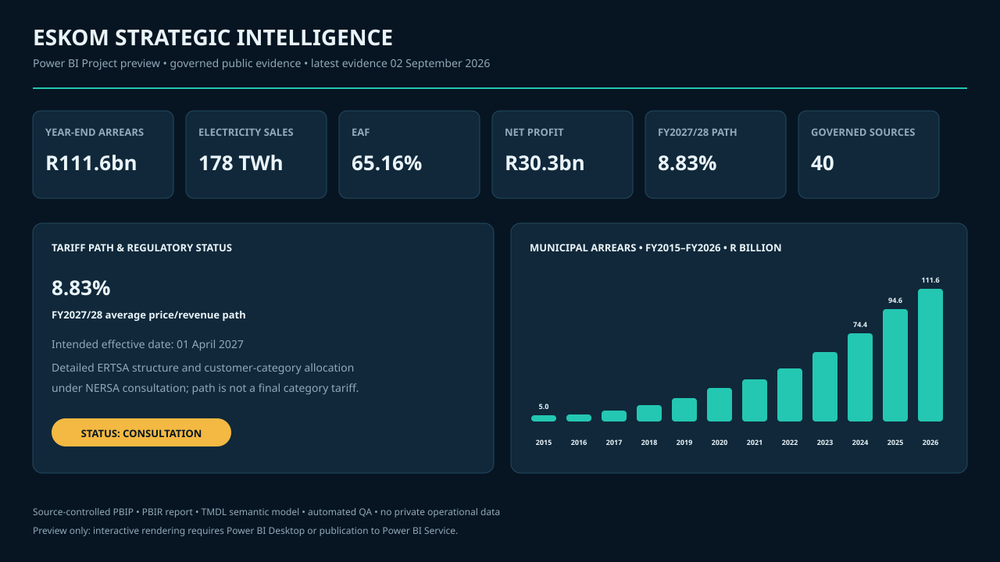

# Eskom Strategic Intelligence

**Power BI · Analytics Engineering · Regulatory Intelligence · Data Quality**

[](https://github.com/GarethMackenzie/eskom-strategic-intelligence/actions/workflows/data-integrity.yml)

An executive analytics case study built from governed public evidence on Eskom's municipal debt,
electricity demand, tariffs, financial performance and physical-security risk. The repository
contains a complete, editable Power BI Project (`.pbip`), an enhanced PBIR report, a TMDL semantic
model, SQLite analytics, Python automation, automated QA and CI.

**Data reported as of 4 September 2026.** Management scenarios are physically separated from
reported actuals. No customer, employee, confidential operational or personal data is used.



> The image is a labelled design preview, not a fabricated Power BI screenshot. GitHub hosts the
> complete text-based Power BI source. Interactive browser use requires publication to Power BI
> Service. The project was live-tested in Power BI Desktop 2.157.1354.0 (August 2026) on
> 7 September 2026; details are recorded in [`docs/POWER_BI_RUNBOOK.md`](docs/POWER_BI_RUNBOOK.md).

## Executive snapshot

| Metric | Reported value | Context | Evidence |
|---|---:|---|---|
| FY2027/28 average price path | **8.83%** | Intended from 1 April 2027 | NERSA revenue path; retail structure under consultation at 4 Sep 2026 |
| FY2026/27 direct-customer increase | 8.76% | Implemented 1 April 2026 | Official Eskom/NERSA decision |
| FY2026/27 municipal bulk increase | 9.01% | Implemented 1 July 2026 | Official Eskom/NERSA decision |
| Municipal arrears, year-end | R111.6bn | +17.9% YoY | Official Eskom disclosure |
| Municipal arrears, latest in-year | R119.9bn | June 2026 | Secondary exact figure; official release says approximately R119bn |
| Electricity sales | 178 TWh | -6.2% YoY | Official Eskom disclosure |
| Energy Availability Factor | 65.16% | Up from 60.6% | Official Eskom disclosure |
| Net profit after tax | R30.3bn | Second consecutive profit | Official Eskom disclosure |
| Municipal arrears scenario | R358bn by FY2031 | No-intervention management scenario | **Scenario — not a reported actual** |

## Power BI solution

Open [`EskomStrategicIntelligence.pbip`](EskomStrategicIntelligence.pbip) in a current version of
Power BI Desktop. The source-controlled solution contains:

- 5 report pages: Executive Overview, Tariff & Affordability, Municipal Debt, Operations &
  Security, and Data Governance
- 68 report visuals with slicers, executive KPIs, trends, regulatory status and source-lineage tables
- 30 explicit DAX measures organised by business domain
- 6 semantic-model tables with 3 governed relationships
- 38 evidence-register records embedded in the semantic model
- self-contained Power Query tables, with no local absolute path or external credential dependency
- a reusable corporate theme and permanent evidence/limitations disclosures

The 8.83% card is deliberately qualified: it represents the FY2027/28 average revenue/price path.
The detailed retail tariff structure and customer-category allocation were still under NERSA
consultation on 4 September 2026. The illustrative cumulative tariff index is a mathematical index,
not a household or business bill forecast.

## Analytical architecture

```text
38-record governed public source register
                 |
      Python ingestion and validation
                 |
       SQLite dimensional model
                 |
 11 build-time checks + 27 release tests
                 |
 PBIP -> PBIR report -> TMDL semantic model
                 |
      5-page executive Power BI report
```

`python scripts/build_project.py` deterministically rebuilds the Power BI source, SQLite database
and QA summary. CI compiles Python, executes every SQL file, rebuilds the PBIP/PBIR/TMDL artefacts,
runs the full test suite and validates the release outputs.

## What the analysis shows

- The 8.83% FY2027/28 average path is established, but it should not be presented as a fully final
  customer-category tariff schedule while the detailed retail structure is under consultation.
- Point-in-time municipal debt must resolve to one dated observation; summing historical balances
  would create a meaningless total.
- The June 2026 in-year balance (R119.9bn) and FY2026 year-end balance (R111.6bn) answer different
  questions and remain separate throughout SQL, DAX and the report.
- Sales fell while plant availability improved. The project reports the association and does not
  claim a causal relationship.
- Public evidence supports aggregate physical-security metrics, not a coal-specific loss series.
- Two credible sources conflict on the FY2024 municipal-arrears baseline; both remain visible as an
  unresolved reconciliation item.

## Engineering controls

- source lineage at observation grain through `source_dataset_id`
- separate reported-actual, regulatory-path and scenario facts
- leakage-safe report freshness that excludes scenario horizons
- explicit latest-observation and fiscal-year-end measures
- dual-source lineage for the 8.83% value and its current consultation status
- idempotent SQLite DDL and seed scripts
- deterministic PBIP/PBIR/TMDL generation with stable object identifiers and page-level slicers
- structural tests for report pages, visual references, model relationships and local-path safety
- privacy and secret scanning across tracked text
- GitHub Actions on push, pull request and manual dispatch

## Repository guide

| Path | Purpose |
|---|---|
| `EskomStrategicIntelligence.pbip` | Power BI Desktop project entry point |
| `EskomStrategicIntelligence.Report/` | Enhanced PBIR report definition and theme |
| `EskomStrategicIntelligence.SemanticModel/` | TMDL model, measures, tables and relationships |
| `scripts/build_project.py` | One-command database, QA and Power BI build |
| `scripts/build_powerbi_project.py` | Deterministic PBIP/PBIR/TMDL generator |
| `src/` | CSV ingestion, database build and validation package |
| `sql/` | SQLite staging, dimensions, facts, QA and analytical views |
| `tests/` | Data, methodology, privacy and Power BI structural release tests |
| `docs/data_source_register.csv` | 38-record evidence and provenance register |
| `reports/` | Evidence-tagged strategic intelligence report |

## Reproduce the release

Python 3.11 or later is required.

```bash
python -m pip install -r requirements.txt
python scripts/build_project.py
python -m pytest -q
```

Expected result: **11/11 build-time checks pass and 27/27 pytest tests pass**.

For Power BI Desktop and Service steps, see the
[`Power BI runbook`](docs/POWER_BI_RUNBOOK.md).

## Responsible interpretation

- This is a portfolio-grade public-data case study, not an Eskom operational system.
- The 8.83% path remains subject to the regulatory qualifications recorded in the source register.
- Forecasts, scenarios and recommendations are not presented as reported actuals.
- Association is not presented as causation.
- Granular municipality, customer-segment and coal-specific security data gaps remain visible.
- Data and regulatory status should be revalidated before real-world decision use.

Read the [full report](reports/eskom_strategic_intelligence_report.md),
[methodology](docs/methodology.md), [data model](docs/data_model.md),
[quality scorecard](docs/QUALITY_SCORECARD.md) and [limitations](docs/limitations.md).
