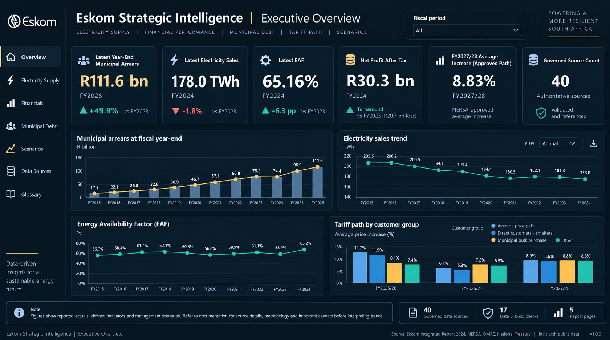

# Eskom Strategic Intelligence

**Power BI · Analytics Engineering · Regulatory Intelligence · Data Quality**

[](https://github.com/GarethMackenzie/eskom-strategic-intelligence/actions/workflows/data-integrity.yml)

An end-to-end analytics engineering case study built from governed public evidence on Eskom's municipal debt, electricity demand, tariffs, financial performance and physical-security risk.

The project combines Power BI, PBIP/PBIR, TMDL, DAX, SQLite, Python, automated QA and GitHub Actions in a reproducible analytical system.

**Latest non-scenario evidence: 2 September 2026.** This date is derived from the governed source register. No private customer, employee or operational data is used.

## Dashboard preview



Presentation preview using governed project metrics. Recorded Power BI Desktop runtime validation is documented separately in [`docs/POWER_BI_RUNBOOK.md`](docs/POWER_BI_RUNBOOK.md).

## What this demonstrates

- Power BI engineering with PBIP, PBIR, TMDL and DAX
- Governed public-data sourcing with explicit lineage
- Dimensional modelling through SQLite
- Automated data-quality release gates
- Deterministic report generation and source control
- Separation of reported actuals, in-year observations, regulatory paths and management scenarios

## Executive snapshot

| Metric | Value | Evidence status |
|---|---:|---|
| FY2026 municipal arrears | **R111.6bn** | Official year-end actual |
| June 2026 municipal arrears | **R119.9bn** | In-year observation, separate from year-end |
| FY2015-FY2026 arrears CAGR | **32.62%** | Derived from the governed annual series |
| Electricity sales | **178 TWh** | Official FY2026 disclosure |
| Energy Availability Factor | **65.16%** | Official FY2026 disclosure |
| Net profit after tax | **R30.3bn** | Official FY2026 disclosure |
| FY2026/27 direct / municipal averages | **8.76% / 9.01%** | Implemented |
| FY2027/28 average price path | **8.83%** | Average path, not every customer's tariff |
| FY2031 arrears | **R358bn** | Eskom management no-intervention scenario |
| Governed sources | **40** | Latest evidence 2 September 2026 |

**Municipal arrears trend, FY2015–FY2026:** `▁▁▁▂▂▃▃▄▅▆▇█` from R5.0bn to R111.6bn.

## Architecture

```text
40-record governed public source register
                  |
         SQLite dimensional model
                  |
 17 release-blocking data-quality checks
                  |
 validated semantic export views
                  |
 PBIP generator -> TMDL + PBIR + DAX + SVG + verified PNG fallback
                  |
       5-page Power BI report
```

`scripts/build_project.py` builds SQLite first, runs release-blocking QA, then generates the Power BI artifacts from validated `vw_powerbi_*` views. The generator does not duplicate business-fact arrays. One Python measure catalog emits both TMDL measures and the reviewable `powerbi/dax/measures.dax` export.

## Data governance and source correction

The canonical municipal and metro arrears series uses Eskom's official FY2015-FY2026 values:

| FY | Rbn | FY | Rbn | FY | Rbn |
|---:|---:|---:|---:|---:|---:|
| 2015 | 5.0 | 2019 | 19.9 | 2023 | 58.5 |
| 2016 | 6.0 | 2020 | 28.0 | 2024 | **74.4** |
| 2017 | 9.4 | 2021 | 35.3 | 2025 | 94.6 |
| 2018 | 13.6 | 2022 | 44.8 | 2026 | 111.6 |

An earlier version treated **R55.3bn** as FY2024 total arrears. Source reconciliation showed the correct FY2024 total was **R74.4bn**. National Treasury identifies **R55.3bn** as the approved legacy-debt scope of 71 Municipal Debt Relief Programme applications, based on debt at 31 March 2023.

The programme-scope value now sits in a separate table and cannot enter the annual total-arrears trend. The June 2026 R119.9bn observation remains a separate in-year snapshot. The FY2031 R358bn value remains an Eskom management scenario.

NERSA's 8.83% FY2027/28 figure is modelled as an average price/revenue path. The detailed Eskom Retail Tariff Structural Adjustment and customer-category allocation were placed under consultation by NERSA on 2 September 2026 and are not presented as final category tariffs.

## Power BI solution

Open `EskomStrategicIntelligence.pbip` in a current Power BI Desktop release. The source-controlled project contains:

- 5 report pages and 68 visuals
- 6 semantic-model tables and 3 one-way relationships
- 34 explicit measures with dynamic latest/prior comparator logic
- the complete 40-record evidence register
- separate reported-actual, in-year, tariff-path and scenario structures
- a portable inline model with no absolute local paths or credentials

See [`docs/POWER_BI_RUNBOOK.md`](docs/POWER_BI_RUNBOOK.md) for the recorded Desktop runtime test and the Power BI Service publication boundary.

## Release readiness

| Gate | Status |
|---|---|
| Automated repository QA | PASS, 17 build checks and 32 tests |
| GitHub Actions | PASS on current main |
| Power BI Desktop model runtime | PASS, compatibility level 1606 |
| Human visual/accessibility review | PASS, user-confirmed final review completed |
| Power BI Service publication | Outside repository release scope |
| GitHub v1.0.0 release | Ready for publication, not yet published |

The repository is technically release-ready. A GitHub `v1.0.0` release has not yet been published.

## Reproduce the project

Python 3.11 or later is required.

```bash
python -m pip install -r requirements.txt
python -m compileall -q src scripts tests
python -m ruff check src scripts tests
python -m ruff format --check src scripts tests
python scripts/build_project.py
python -m pytest -q
git diff --exit-code
python scripts/build_project.py
git diff --exit-code
```

The final build and diff checks verify the SQL/PBIP build, automated tests and byte-stable regeneration against source control. CI runs the same gates on pushes and pull requests to `main`.

## Repository guide

| Path | Purpose |
|---|---|
| `EskomStrategicIntelligence.pbip` | Power BI Desktop entry point |
| `EskomStrategicIntelligence.Report/` | PBIR report pages, visuals and theme |
| `EskomStrategicIntelligence.SemanticModel/` | TMDL model, tables, measures and relationships |
| `docs/data_source_register.csv` | Governed provenance register |
| `sql/15_semantic_exports.sql` | Canonical SQLite-to-Power-BI interface |
| `scripts/build_project.py` | Build, QA and Power BI orchestration |
| `scripts/build_powerbi_project.py` | Deterministic artifact generator and measure catalog |
| `tests/` | Data, source, semantic-model, visual and portability tests |
| `reports/eskom_strategic_intelligence_report.md` | Evidence-led strategic report |

## Responsible interpretation

- Point-in-time balances must never be summed across dates.
- Actuals, in-year observations and management scenarios answer different questions.
- The sales/EAF relationship is descriptive and does not establish causation.
- Security metrics are aggregate physical-security disclosures, not coal-specific.
- Municipality-level, customer-segment and coal-specific public-data gaps remain explicit.
- Revalidate data and regulatory status before real-world decision use.

## Supporting documentation

- [Strategic report](reports/eskom_strategic_intelligence_report.md)
- [Methodology](docs/methodology.md)
- [Data model](docs/data_model.md)
- [Quality scorecard](docs/QUALITY_SCORECARD.md)
- [Technical audit](docs/technical_audit.md)
- [Limitations](docs/limitations.md)
- [Power BI runbook](docs/POWER_BI_RUNBOOK.md)
