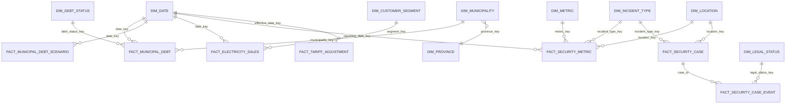

# Data Model - Eskom Strategic Intelligence (Release Review)

This document is checked line-by-line against the actual `sql/` DDL, not written independently of
it — every grain, key, and measure classification below was re-verified against the SQL after the
Phase 2 remediation (see `docs/technical_audit.md`). Where Phase 1's documentation diverged from
what the SQL actually did, that divergence is called out explicitly rather than silently fixed.

## ERD (Mermaid)

## Design principle carried from Phase 1, reinforced in Phase 2
A model with fabricated rows to "fill" a map or a Pareto chart would look complete and would be
wrong. Every table below is either fully populated (stable reference dimensions) or honestly
sparse with the gap tracked in `docs/limitations.md` — never silently interpolated.

## Facts

### fact_municipal_debt
**Grain:** one row per (date_key, municipality_key). **Additive measure:** `gross_arrears_rand` is
a stock/balance measure — additive across municipalities at a single date_key (a real Pareto sum
once Data Gap #1 closes), but **non-additive across date_key for the same municipality** (summing
FY2025 + FY2026 balances is meaningless — this was the Phase-1 P0-3 bug). `write_off_rand` is a
flow measure, additive within a fiscal year. **Primary key:** (date_key, municipality_key).
**Foreign keys:** date_key → dim_date, municipality_key → dim_municipality, debt_status_key →
dim_debt_status. **Fact type:** semi-additive (additive across municipality, non-additive across
time for the same municipality — the classic "bank balance" semi-additive pattern). **Source
lineage:** source_dataset_id NOT NULL on every row. **Actual vs scenario:** this table holds
*actuals only* (evidence_type ∈ {FACT_REPORTED, CALCULATION_DERIVED}); no scenario row can exist
here by construction.

### fact_municipal_debt_scenario
**Grain:** one row per (date_key, scenario_name). **Physically separate** from
`fact_municipal_debt` — deliberate design choice (Step 6/Step 5 remediation) so no join or SUM
against the actuals table can accidentally include a scenario figure. **Measure:**
`projected_arrears_rand` — non-additive, single terminal projection value, not a trajectory (no
intermediate years disclosed).

### fact_electricity_sales
**Grain:** one row per (date_key, segment_key). **Measures:** `sales_twh` (additive across
segment, flow measure over the fiscal year — not a stock), `revenue_rand` (additive, flow).
**Currently populated:** segment_key=0 (ALL SEGMENTS) only — Data Gap #2 open.

### fact_security_metric
**Grain:** one row per (reporting_date_key, incident_type_key, metric_key, location_key).
**Measure:** `metric_value` — additive across incident_type/location for count/Rand metrics
(Estimated Loss, Arrests, Recoveries, Convictions); **non-additive** for YoY%-typed metric_keys
(6, 7, 8, 1) — a percentage must never be summed across periods. This distinction is enforced by
`dim_metric.metric_name`/`unit`, not by a separate physical table, so any consuming query/DAX
measure must check `unit = 'Percent'` before deciding whether SUM is valid. **Source lineage:**
one `source_dataset_id` per metric-level observation (Step 4 fix — Phase 1 bundled five metrics
under one shared ID).

### fact_security_case / fact_security_case_event
**Grain:** `fact_security_case` — one row per named, individually-sourced incident.
`fact_security_case_event` — one row per chronological legal-process event for that case
(non-additive; a "count of events" is meaningful, a "sum of legal_status_key" is not — it's a
categorical key, not a measure). **Foreign key:** `fact_security_case_event.case_id` →
`fact_security_case.case_id`, allowing many events per case without overwriting history (Step 3
fix — Phase 1 had no event-history concept, only a single mutable `legal_status` string per case).

### fact_tariff_adjustment
**Grain:** one row per (effective_date_key, customer_group). **Measure:** `increase_pct`, stored as
the published average increase for that customer group or average price path. **Lineage:**
`source_dataset_id` supports the numeric value and `status_source_dataset_id` supports the current
regulatory status. The FY2027/28 8.83% row therefore points to NERSA's revenue-path decision
(DS035) and separately to the 4 September 2026 retail-structure consultation update (DS037).
An approved average revenue path is not automatically a final tariff for every customer category.

## Power BI semantic model

The source-controlled TMDL model contains `DimPeriod`, `FactMetric`, `FactTariff`, `FactScenario`,
`SourceRegister` and `Measures`. Three single-direction many-to-one relationships connect the fact
tables to `DimPeriod`. Small public-data observations are embedded as inline Power Query tables,
making the `.pbip` reproducible without local paths or credentials. SQLite remains the executable
analytical-engineering layer; TMDL is the report-serving layer.

## Reconciliation notes (Step 7 explicit requirement)
- Phase 1's `docs/data_model.md` described `FactMunicipalDebt`'s `status` column as if a
  group-total row could carry one meaningful operational status ("Delinquent"). The physical
  schema in Phase 1 did in fact store `'Delinquent'` on the group-total row, so the *documentation
  was consistent with the (flawed) implementation* — but both were wrong, per P1-3 in the technical
  audit. Both have now been corrected together: `dim_debt_status.applies_to_grain` makes the
  distinction physical, not just documented.
- Phase 1's `docs/data_model.md` did not mention `fact_security_case_log`'s reused source ID
  problem because the grain/relationship description was accurate — the defect was in the seed
  *data* (provenance), not the *schema*. This is now fixed in the data, and the schema itself has
  also changed (case + case_event split) to make the same class of error structurally harder to
  reintroduce.

## Still open (see docs/limitations.md for detail)
- Data Gap #1: `dim_municipality` has only one non-placeholder row (City of Johannesburg). No
  municipality-level Pareto/ranking/map is possible yet.
- Data Gap #2: `fact_electricity_sales` has no non-aggregate segment rows.
- Data Gap #3: no coal-specific time series exists; `fact_security_metric` is aggregate-only for
  the FY2026 KPI row, supplemented by the two individually-sourced non-coal cases in
  `fact_security_case` (fuel-oil, valve theft) and the NATJOINTS cluster observation in
  `fact_security_metric` (also non-coal-specific).
- Data Gap #4: municipal debt has 3 comparable fiscal-year-end points and electricity sales has 2
  — insufficient for CAGR (guarded to return BLANK below n=5 in both SQL and DAX).
